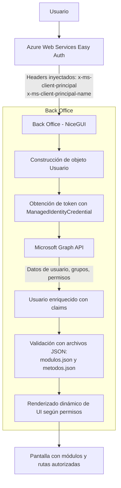

# Documentación Técnica Exhaustiva y Detallada del Proyecto Back Office
---
**Fecha:** 27 de agosto de 2025
---

## Índice
1. [Introducción](#1-introducción)
2. [Arquitectura General](#2-arquitectura-general)
3. [Estructura de Carpetas y Archivos](#3-estructura-base-de-carpetas-y-archivos)
4. [Gestión de Autenticación y Usuario](#4-gestión-de-autenticación-y-usuario)
5. [Rutas y Navegación](#5-rutas-y-navegación)
6. [Estilos y Personalización](#6-estilos-y-personalización)
7. [Configuración y Permisos](#7-configuración-y-permisos)
8. [Dependencias](#8-dependencias)
9. [Logging](#9-logging)
10. [Escalabilidad de Módulos](#10-escalabilidad-de-módulos)
11. [DevOps](#11-devops)

---

## 1. Introducción

Back Office es una aplicación web en Python (NiceGUI) para gestión interna y reportes, con autenticación y permisos centralizados mediante Azure Web Services con Easy Auth y Azure Active Directory. El sistema es modular, escalable. Esta documentación explica su arquitectura, autenticación, permisos y cómo extenderlo.

### Decisión sobre nomenclatura e idioma

Se ha definido que toda la nomenclatura del código (clases, funciones, variables, rutas, carpetas, archivos, loggeos y comentarios) se mantendrá en idioma español. El propósito principal de esta decisión es garantizar la trazabilidad y detección de autoría del código, y poder diferenciarlo del Framework y demás dependencias.


## 2. Arquitectura General

El proyecto Back Office está construido bajo una arquitectura modular, desacoplada y orientada a la seguridad y la escalabilidad. Los principales pilares de la arquitectura son:

- **Frontend y Backend integrados**: La definición de páginas, rutas, lógica de negocio y componentes de UI se realiza íntegramente en Python utilizando el Framework NiceGUI, lo que elimina la necesidad de frameworks separados para frontend y backend. Esto simplifica el desarrollo, el despliegue y el mantenimiento.

- **Gestión de usuarios y autenticación centralizada**: Toda la autenticación y autorización se realiza mediante Azure Active Directory (Azure AD). Los headers inyectados por Azure Web Service permiten identificar al usuario, sus grupos y permisos de forma segura. Esto evita exponer credenciales o lógica sensible en el frontend.

- **Modularidad y desacoplamiento**: Cada funcionalidad principal se encapsula en un módulo independiente bajo la carpeta `modulos/`. Los módulos pueden tener sus propias rutas, páginas, lógica y configuración, lo que facilita la extensión y el mantenimiento del sistema. El menú lateral y la navegación se construyen dinámicamente según los permisos del usuario.

- **Configuración externa y dinámica**: Los permisos, módulos, submódulos y métodos disponibles se definen en archivos JSON (`config/modulos.json` y `config/metodos.json`). Esto permite modificar la estructura funcional y los permisos de la aplicación sin necesidad de modificar el código fuente.

- **Estilos y recursos estáticos centralizados**: Los estilos (colores, fuentes) y los recursos estáticos (imágenes, fuentes tipográficas) se encuentran en carpetas dedicadas, permitiendo una personalización visual sencilla y coherente.

- **Persistencia de sesión y estado**: Se utiliza el almacenamiento de sesión/tab de NiceGUI para mantener el usuario autenticado y sus datos relevantes durante la navegación, mejorando la experiencia de usuario y la seguridad.


#### Flujo de autenticación y autorización

1. El usuario accede a la aplicación y es autenticado automáticamente por Azure Web Services con Easy Auth.
2. Easy Auth agrega headers de identidad a la request HTTP.
3. Al renderizar la primera página (decorada con la plantilla estándar), la aplicación toma los headers y construye el objeto Usuario y lo almacena en el storage/tab.
4. Usando la información de los headers, la aplicación consulta Microsoft Graph API para obtener los grupos y permisos del usuario.
5. Con los permisos y módulos obtenidos, tomando en cuenta la configuración establecida por JSON externos ubicados en la carpeta `config/`, la aplicación renderiza la plantilla y la página, mostrando sólo lo autorizado para ese usuario.
6. En cada ejecución posterior, valida que el objeto persista, y en caso contrario, lo crea nuevamente




## 3. Estructura base de Carpetas y Archivos

La organización del proyecto está pensada para maximizar la claridad, la escalabilidad y la facilidad de mantenimiento. A continuación se describe cada carpeta y archivo relevante:

```
main.py                        # Punto de entrada de la aplicación. Inicializa NiceGUI y registra rutas de módulos.
requirements.txt               # Lista de dependencias del proyecto para pip.
config/                        # Configuración dinámica de módulos y métodos.
   metodos.json                 # Métodos disponibles, descripción, parámetros y grupos de acceso.
   modulos.json                 # Módulos y submódulos, rutas y métodos asociados.
estilos/                       # Estilos personalizados para la UI.
   colores.py                   # Definición de paleta de colores y dark mode.
   fuentes.py                   # Definición y carga de fuentes personalizadas.
modulos/                       # Módulos funcionales de la aplicación.
   principal/                   # Módulo principal: inicio, cierre de sesión, plantilla, layout.
      rutas.py                   # Registro de rutas principales.
      plantilla.py               # Decorador para layout estándar.
      paginas/                   # Páginas específicas (inicio, cierre de sesión, etc).
   ejemplo/                     # Módulo de ejemplo para copiar y escalar.
      rutas.py                   # (Vacío, para implementar nuevas rutas).
      paginas/                   # (Vacío, para implementar nuevas páginas).
static/                        # Archivos estáticos (imágenes, fuentes, favicon).
   fonts/                       # Fuentes personalizadas (woff2).
   img/                         # Imágenes y logos.
usuario_sesion/                # Lógica de usuario y sesión.
   usuario.py                   # Clase Usuario, lógica de autenticación y permisos.
   manejador_usuario.py         # Funciones para construir y validar usuario en sesión.
```


## 4. Gestión de Autenticación y Usuario

La seguridad y la personalización de la experiencia de usuario en el Back Office se basan en una integración profunda con Azure Web Services con Easy Auth y Azure Active Directory (a través del uso de Microsoft Graph API). A continuación se detalla el flujo completo, los headers utilizados, la construcción y ciclo de vida de la clase Usuario, y la persistencia de la sesión.

### Headers inyectados por Azure

La autenticación se basa en los headers HTTP inyectados automáticamente por Azure AD en cada request. Los headers clave son:

- `x-ms-client-principal`: Contiene información codificada en base64 sobre el usuario autenticado, incluyendo claims, identificador único (`objectidentifier`), grupos, etc.
- `x-ms-client-principal-name`: Email del usuario autenticado.

Estos headers permiten identificar de forma segura al usuario y sus permisos, sin exponer credenciales ni lógica sensible en el frontend.


### Construcción y ciclo de vida de la clase Usuario

La clase `Usuario` (ubicada en `usuario_sesion/usuario.py`) es el núcleo de la gestión de identidad y permisos. Su ciclo de vida es el siguiente:

1. **Construcción**: Se instancia a partir de los headers de la request. Decodifica el header `x-ms-client-principal` y extrae los claims, incluyendo el identificador único del usuario (`objectidentifier`).
2. **Obtención de token**: Utiliza `ManagedIdentityCredential` para obtener un token de acceso a Microsoft Graph API.
3. **Consulta de datos en Graph API**: Con el token, consulta los grupos a los que pertenece el usuario (`/memberOf`), así como su nombre y foto (`/users/{id}` y `/users/{id}/photo/$value`).
4. **Filtrado de permisos y módulos**: Según los grupos obtenidos, filtra los métodos permitidos desde `config/metodos.json` y los módulos/submódulos desde `config/modulos.json`.
5. **Persistencia**: El objeto Usuario se almacena en la sesión/tab del cliente usando el storage de NiceGUI.
6. **Validación continua**: En cada request, se valida si el usuario de sesión coincide con el de los headers actuales. Si no coincide, se reconstruye el usuario.


#### Métodos clave de la clase Usuario:
- `obtener_token_graph()`: Obtiene token de acceso para Graph API.
- `extraer_principal_cliente()`: Decodifica y extrae claims del header.
- `obtener_id_usuario_azure()`: Extrae el objectidentifier.
- `obtener_email_usuario()`: Extrae el email.
- `obtener_grupos_usuario_desde_graph()`: Consulta los grupos vía Graph API.
- `obtener_nombre_usuario()`, `obtener_foto_usuario()`: Consultan nombre y foto vía Graph API.
- `obtener_permisos_metodo()`: Filtra métodos permitidos según grupos.
- `obtener_modulos_usuario()`: Filtra módulos/submódulos según métodos.

#### Persistencia y validación de sesión

El usuario se almacena en el storage/tab de NiceGUI:
```python
almacenamiento = app.storage.tab
almacenamiento['usuario'] = Usuario(headers)
```
Para validar si el usuario de sesión es el mismo que el de los headers:
```python
usuario_actual: Usuario = almacenamiento['usuario']
email_actual = usuario_actual.email
email_headers = headers.get("x-ms-client-principal-name", "").lower()
return email_actual == email_headers
```


## 5. Rutas y Navegación

El sistema de rutas y navegación en el Back Office está diseñado para ser flexible, seguro y completamente dinámico según los permisos del usuario autenticado.

### Definición de rutas

- Las rutas se definen en los archivos `rutas.py` de cada módulo, utilizando el decorador `@ui.page` de NiceGUI. Finalmente, todo se importa en el archivo `main.py`.
- Cada función decorada representa una página accesible mediante una URL específica.
- Es necesario que cada página utilice el decorador `@plantilla` para heredar el layout estándar que permite la navegación.

### Navegación dinámica y menú lateral

- El menú lateral se construye dinámicamente en base a los módulos y submódulos permitidos al usuario, según los permisos definidos en los archivos de configuración y los grupos a los que pertenece.
- Solo se muestran en el menú las rutas y acciones para las que el usuario tiene permisos.
- El menú se actualiza automáticamente al iniciar sesión, cerrar sesión o cambiar de usuario.

### Navegación programática

- Desde cualquier función o página, se puede navegar a otra ruta utilizando `ui.navigate.to('/ruta')`.
- Ejemplo:
   ```python
   ui.navigate.to('/nuevo/resumen')
   ```

### Resumen

El sistema de rutas y navegación está completamente desacoplado de la lógica de permisos, permitiendo que la UI se adapte automáticamente a cada usuario y facilitando la extensión del sistema con nuevas páginas y módulos.


## 6. Estilos y Personalización

La personalización visual del Back Office es flexible y centralizada, permitiendo adaptar la identidad visual de la aplicación a los lineamientos de cada organización.

### Colores y dark mode
- Los colores principales, secundarios y de acento se definen en `estilos/colores.py` usando la función `ui.colors()` de NiceGUI.
- El dark mode es soportado de forma nativa y puede ser activado/desactivado por el usuario desde el pie de página.
- Ejemplo de definición de colores:
   ```python
   ui.colors(
         primary='#FFFFFF',
         secondary='#252525',
         dark='#252525',
         dark_page="#252525",
         verdeoscuro='#005F5A',
         verdeclaro='#35B6B4',
         blanco='#FFFFFF',
         grisoscuro="#252525",
         rojo='#F44336'
   )
   ```

### Fuentes personalizadas
- Las fuentes se definen y cargan en `estilos/fuentes.py`.
- Se utiliza la fuente "Platform" (archivos woff2 en `static/fonts/`), aplicada globalmente mediante CSS inyectado en el head del documento.
- Ejemplo de carga de fuente personalizada:
   ```python
   ui.add_head_html("""
   <style>
   @font-face {
         font-family: 'Platform';
         src: url('/static/fonts/Platform-Regular.woff2') format('woff2');
         font-weight: normal;
         font-style: normal;
   }
   body {
         font-family: 'Platform', sans-serif !important;
   }
   </style>
   """)
   ```

### Imágenes y recursos estáticos
- Todas las imágenes, logos y favicon se encuentran en `static/img/`.
- Las fuentes personalizadas se ubican en `static/fonts/`.
- Es recomendable centralizar todos los recursos estáticos para facilitar el despliegue y la personalización.

### Recomendaciones
- Mantén la paleta de colores y las fuentes alineadas con la identidad visual de la organización.
- Si se agregan nuevos módulos con recursos propios, crea subcarpetas dentro de `static/` para mantener el orden.

Esta estructura permite que la aplicación sea visualmente coherente, moderna y fácilmente adaptable a diferentes marcas o necesidades.


## 7. Configuración y Permisos

La gestión de permisos y la estructura funcional de la aplicación se definen externamente mediante archivos JSON en la carpeta `config/`. Esto permite modificar la navegación, los accesos y los métodos disponibles sin necesidad de modificar el código fuente.

### config/modulos.json
- Define la estructura de módulos, submódulos, rutas y métodos permitidos.
- Cada módulo tiene un nombre mostrado, descripción, ruta base y una lista de submódulos.
- Cada submódulo define su nombre, ruta, nombre mostrado en el frontend, descripción y los métodos que lo componen.

#### Ejemplo:
```json
{
   "reportes": {
      "nombre_mostrado": "Reportes",
      "descripcion": "Módulo para gestionar reportes.",
      "ruta": "/reportes",
      "submodulos": [
         {
            "nombre": "reporte_transacciones",
            "ruta": "/reportes/transacciones",
            "nombre_mostrado_front": "Transacciones",
            "descripcion": "Permite ver y descargar el reporte de transacciones.",
            "metodos_contenidos": ["ver_reporte_transacciones", "descargar_reporte_transacciones"]
         }
      ]
   }
}
```

### config/metodos.json
- Define los métodos disponibles, su descripción, parámetros y los grupos de acceso requeridos.
- Cada método especifica el nombre, descripción, método HTTP, URL, parámetros y los grupos de área y nivel que pueden acceder.

#### Ejemplo:
```json
{
   "ver_reporte_transacciones": {
      "nombre": "ver_reporte_transacciones",
      "descripcion": "Permite ver el reporte de transacciones.",
      "metodo": "GET",
      "url_dirigida": "/reportes/transacciones",
      "parametros": ["fecha_inicio", "fecha_fin"],
      "Area-group": ["Operaciones", "Administración", "Tecnología"],
      "Level-group": ["Contributor Level", "Lead Level", "Head Level", "C Level", "Admin", "SuperAdmin"]
   }
}
```

### Validación de permisos
- El sistema valida los permisos del usuario al construir el menú lateral y al acceder a cada página o acción.
- Solo se muestran y habilitan los módulos, submódulos y métodos para los que el usuario tiene permisos, según sus grupos de Azure AD.

### Recomendaciones
- Mantén la configuración de permisos y módulos actualizada y documentada.
- Si se agregan nuevos módulos o métodos, actualiza ambos archivos JSON para reflejar los cambios.
- Utiliza nombres descriptivos y consistentes para facilitar el mantenimiento.

Esta configuración externa permite una administración flexible y segura de los accesos y la estructura funcional del sistema.


## 8. Dependencias

### Requisitos principales
- Python >= 3.8
- [NiceGUI](https://nicegui.io/)
- uvicorn, gunicorn (servidores ASGI para producción)
- requests (HTTP client)
- azure-core, azure-identity (integración con Azure y autenticación)

### Recomendaciones de entorno
- Mantén actualizado el archivo `requirements.txt` si agregas nuevas dependencias.


## 9. Logging

El proyecto utiliza el módulo estándar `logging` de Python para registrar eventos, errores y advertencias relevantes durante la ejecución de la aplicación. El logging es fundamental para el diagnóstico, la auditoría y la mejora continua del sistema.

### Prácticas recomendadas
- Utiliza diferentes niveles de logging (`debug`, `info`, `warning`, `error`, `critical`) según la importancia del evento.
- Registra errores de autenticación, fallos en la consulta a Graph API, problemas de permisos y cualquier excepción relevante.
- Centraliza los logs en archivos o servicios externos (por ejemplo, Azure Monitor, Application Insights) en entornos productivos.
- No loguees información sensible como tokens o datos personales completos.


## 10. Escalabilidad de Módulos

El sistema está diseñado para escalar fácilmente agregando nuevos módulos funcionales, permitiendo que cada área de negocio o funcionalidad tenga su propio espacio, rutas y lógica. La arquitectura modular facilita la colaboración entre equipos y la incorporación de nuevas funcionalidades sin afectar el núcleo del sistema.

### Guía paso a paso para crear un nuevo módulo

1. **Copiar la carpeta de ejemplo**:
    - Duplicar la carpeta `modulos/ejemplo` y renombrarla (por ejemplo, `modulos/nuevo`).
    - Dentro de la nueva carpeta, ajustar los nombres de archivos y clases según el nuevo módulo.
    - Es indispensable mantener la estructura interna: `rutas.py` para registrar rutas y `paginas/` para las páginas del módulo, de manera que todo el proyecto pueda mantener la misma estructura.

2. **Crear/editar las páginas del módulo**:
    - Agregar las páginas en `modulos/nuevo/paginas/`.
    - Cada página debe ser una función asíncrona decorada con `@ui.page` y con `@plantilla` para heredar el layout estándar y la validación de identidad. ESTE PASO ES FUNDAMENTAL.
    - Ejemplo de página:
       ```python
       from nicegui import ui
       from modulos.principal.plantilla import plantilla

       @plantilla
       async def pagina_resumen():
             ui.label('Resumen')
       ```

3. **Registrar las rutas**:
    - Editar o crear el archivo `modulos/ventas/rutas.py`.
    - Importar las funciones/páginas que se quieran registrar como rutas.
    - Ejemplo:
       ```python
       from modulos.ventas.paginas.resumen import pagina_resumen
       # ...otras importaciones de páginas...

       # Página de inicio
        @ui.page('/',)
        async def resumen():
            await pagina_resumen()
       ```

4. **Actualizar la configuración**:
    - Agregar el nuevo módulo y sus submódulos en `config/modulos.json`.
    - Definir los métodos y permisos en `config/metodos.json`.
    - Ejemplo de entrada en `modulos.json`:
       ```json
       "nuevo": {
          "nombre_mostrado": "Nuevo",
          "descripcion": "Nuevo módulo.",
          "ruta": "/nuevo",
          "submodulos": [
             {
                "nombre": "resumen",
                "ruta": "/nuevo/resumen",
                "nombre_mostrado_front": "Resumen",
                "descripcion": "Resumen.",
                "metodos_contenidos": ["ver_resumen_nuevo"]
             }
          ]
       }
       ```
    - Ejemplo de entrada en `metodos.json`:
       ```json
       "ver_resumen_nuevo": {
          "nombre": "ver_resumen_nuevo",
          "descripcion": "Permite ver el resumen.",
          "metodo": "GET",
          "url_dirigida": "/nuevo/resumen",
          "parametros": [],
          "Area-group": ["Operaciones", "Administración"],
          "Level-group": ["C-Level", "Admin", "SuperAdmin"]
       }
       ```

5. **Importar las rutas en main.py**:
    - Importar el archivo de rutas del nuevo módulo en `main.py`:
       ```python
       import modulos.ventas.rutas
       ```
6. **Cargar las nuevas dependencias**
    - Agregar las dependencias pertinentes en `requirements.txt`.

7. **Reinicia la aplicación** para que los cambios tengan efecto.

### Mejores prácticas y recomendaciones

- Mantén la lógica de cada módulo aislada en su carpeta.
- Utiliza la plantilla estándar para asegurar coherencia visual y funcional.
- Documenta cada nuevo módulo y sus rutas en el README o documentación técnica.
- Usa nombres descriptivos y consistentes para archivos, funciones y rutas.
- Si el módulo requiere recursos estáticos propios, crea una subcarpeta dentro de `static/`.
-

Esta metodología permite que el sistema crezca de manera ordenada, facilitando la colaboración y el mantenimiento a largo plazo.


## 11. DevOps

### Levantar servidor desarrollo
```powershell
python main.py

uvicorn main:app_ng --host 0.0.0.0 --port 8000
```

### Crear una aplicación en Azure Web Service
Configura la aplicación según la infraestructura establecida.

### Configuración de redes
Restringe el acceso únicamente a usuarios dentro de la VPN mediante Configuración > Redes.

### Añadir proveedor de autenticación
Agrega el proveedor de autenticación deseado desde Configuración > Autenticación.

### Habilitar Identidad Administrada
Activa la identidad administrada de la aplicación desde Configuración > Identidad.

#### Cómo Asignar Permisos a una Identidad Administrada con PowerShell

La forma correcta de asignar permisos de API (como Microsoft Graph) a una Identidad Administrada es mediante PowerShell o Azure CLI. No se puede hacer desde la interfaz gráfica del portal.

El proceso consiste en otorgar los permisos directamente al Service Principal de tu Identidad Administrada.

Aquí te muestro el método más común usando PowerShell.

1. **Conéctate a Azure AD**
Abre PowerShell y ejecuta los siguientes comandos para instalar los módulos necesarios (si no los tienes) y conectarte.

```powershell
# Instalar el módulo si no lo tienes
Install-Module Microsoft.Graph -Scope CurrentUser

# Conectarte con los permisos necesarios para asignar permisos
Connect-MgGraph -Scopes "AppRoleAssignment.ReadWrite.All", "Application.Read.All"
```

2. **Busca tu Identidad Administrada**
Necesitas encontrar el Service Principal de tu Identidad Administrada. Puedes buscarlo por su nombre (el mismo nombre que el recurso de Azure que la usa).

```powershell
# Reemplaza "Nombre-De-Tu-Identidad-Administrada"
$managedIdentity = Get-MgServicePrincipal -Filter "displayName eq 'Nombre-De-Tu-Identidad-Administrada'"
```

3. **Busca la API a la que quieres dar permisos (Microsoft Graph)**
Casi siempre, la API que necesitas es Microsoft Graph.

```powershell
$graphApi = Get-MgServicePrincipal -Filter "appId eq '00000003-0000-0000-c000-000000000000'"
```

4. **Busca el Permiso Específico que Quieres Asignar**
Ahora, necesitas encontrar el permiso (llamado AppRole) que quieres otorgar. Por ejemplo, si quieres leer todos los perfiles de usuario, usarías User.Read.All.

```powershell
# Reemplaza "User.Read.All" con el permiso que necesites
$appRole = $graphApi.AppRoles | Where-Object { $_.Value -eq "User.Read.All" }
```

5. **Asigna el Permiso**
Este es el paso final donde conectas tu Identidad Administrada con el permiso de la API.

```powershell
# Asignar el rol a la identidad administrada
New-MgServicePrincipalAppRoleAssignment -ServicePrincipalId $managedIdentity.Id -PrincipalId $managedIdentity.Id -ResourceId $graphApi.Id -AppRoleId $appRole.Id
```

¡Y listo! Después de ejecutar estos comandos, tu Identidad Administrada tendrá el permiso User.Read.All (o el que hayas elegido) para llamar a la API de Microsoft Graph. Aunque no lo veas reflejado en la sección de "Permisos" del portal de la misma forma que con un registro de aplicación, el permiso estará activo y funcional.